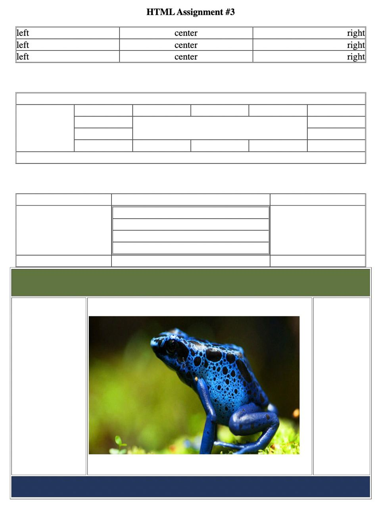
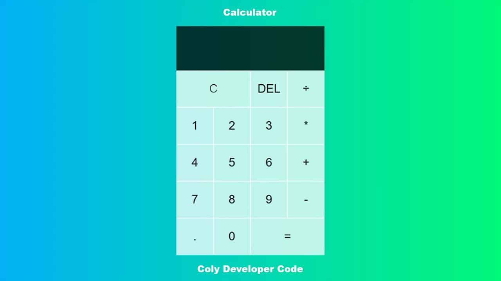

# Fundamental roadmap

> This roadmap can be forked, shared and edited. If you like this roadmap just, give some stars 🙂
## 1.1 Select IDE's
* Sources
    - [Visual studio Code](https://www.youtube.com/watch?v=VqCgcpAypFQ)
    - [ATOM](https://www.youtube.com/watch?v=aiXNKHKWlmY)
    - [Sublime text editor](https://www.youtube.com/playlist?list=PLpcSpRrAaOaqQMDlCzE_Y6IUUzaSfYocK)
    - [Brackets](https://www.youtube.com/watch?v=GN0txxeT46A)
    - [Intellij Webstorm](https://www.youtube.com/watch?v=WlBrhM1_t5k)
* Assignment 
    * Download and install VS Code.
    * Create a new file.
    * See an overview of the user interface.
    * Install support for your favorite programming language.
    * Change your keyboard shortcuts and easily migrate from other editors using keymap extensions.
    * Customize your editor with themes.
    * Explore VS Code features in the [Interactive Editor Playground](https://code.visualstudio.com/docs/introvideos/basics).

## 1.2 Introduction to HTML
* Sources
    - [Basic of HTML](https://www.youtube.com/watch?v=qz0aGYrrlhU)
    - [Semantic HTML](https://www.youtube.com/watch?v=kGW8Al_cga4)
    - [HTML forms](https://www.youtube.com/watch?v=fNcJuPIZ2WE)
    - [HTML graphics](https://www.youtube.com/watch?v=3GqUM4mEYKA)
    - [HTML multimedia and video players](https://www.youtube.com/watch?v=OOy764mDtiA)
* Assignment
    - Create this table structure using HTML table tags and attributes. You can deploy your assignment using github pages ( [tutorial here](https://www.youtube.com/watch?v=QyFcl_Fba-k) )
    
## 1.3 Introduction to CSS
* Sources
    - [Learn basics of CSS](https://www.youtube.com/watch?v=1PnVor36_40)
    - [Intro to Grids](https://www.youtube.com/watch?v=jV8B24rSN5o)
    - [Flexbox](https://www.youtube.com/watch?v=JJSoEo8JSnc)
    - [Media queries in 7 minutes](https://www.youtube.com/watch?v=yU7jJ3NbPdA)
    - [Typography in css](https://www.youtube.com/watch?v=1bfV3z4HKlw)
    - [Introduction to preprocessors](https://www.youtube.com/watch?v=PJkWbezpHpE)
* Assignment
    - Your task is to implement this given UI. No need any functionality here. You will modify it later in JS module.
    

## 1.4 Introduction to JS
* Sources
    - [Learn basics of JS](https://www.youtube.com/watch?v=2qDywOS7VAc)
    - [Learn ES6 features](https://www.youtube.com/watch?v=NCwa_xi0Uuc)
    - [DOM manipulations](https://www.youtube.com/watch?v=y17RuWkWdn8)
    - [Scoping priciples, Scopes](https://www.youtube.com/watch?v=bD-62OMzni0)
    - [Hoisting](https://www.youtube.com/watch?v=AplVrrwY1TI)
    - [Callbacks](https://www.youtube.com/watch?v=cNjIUSDnb9k)
    - [Promise, all, race, reject, resolve...](https://www.youtube.com/watch?v=1idOY3C1gYU)
    - [Async & await](https://www.youtube.com/watch?v=SHiUyM_fFME)
    - [Function types (Classical , unary, arrow functions )](https://www.youtube.com/watch?v=xUI5Tsl2JpY)
## 1.5 Version Controls
* Sources
    - [Learn basics of git](https://www.youtube.com/watch?v=RGOj5yH7evk)
    - [Gitlab introductions](https://www.youtube.com/watch?v=gbJUasioKiI)
    - [Github introductions](https://www.youtube.com/watch?v=w3jLJU7DT5E)
* Assignment
    - This assignment gives you a chance to explore basic use of Git and GitHub.

```
git clone <REPO_URL>

Make a copy of a repository. A typical repository address is https://github.com/Grinnell-CSC195/hw1

git add FILE

This can do one of two things. If FILE is not in the repository, it adds it to the repository. If FILE is already in the repository, it marks it as being part of the current set of files to be committed. (Often, you only want to commit only a subset of the files you've modified, so you use git add on each of those.)

git status

Get the status of your repository. What files have been modified? Which are staged for commit? Which are just new?

git commit

Commits all of the files you're added. Typically, pops up an editor. If vi pops up, use i to switch to insert mode, type the text for the commit, and then type the escape key to get out of insert mode. Then, type :wq to write the file and quit vi.

git commit -m "MESSAGE"

Commits the files you've added, using the given message. (A nice way to avoid the editor.)

git log | less

Shows a log of the changes that have been made. (less lets you page through those changes.)

git push

Send your commits to the primary repository.

git pull

Grab other people's commits from the primary repository.
```
## 1.6 Tooling (Package managers)
* Sources
    - [Introduction to NPM](https://www.youtube.com/watch?v=P3aKRdUyr0s)
    - [Introduction to YARN ](https://www.youtube.com/watch?v=g9_6KmiBISk)
    - [Introduction to Vue-cli and vue-ui](https://www.youtube.com/watch?v=sSH7dndseis)
* Assignment
    - Create Vuejs.3x project which have [Vuex, Vue router, Babel, Eslint, Vuetify plugin ]
