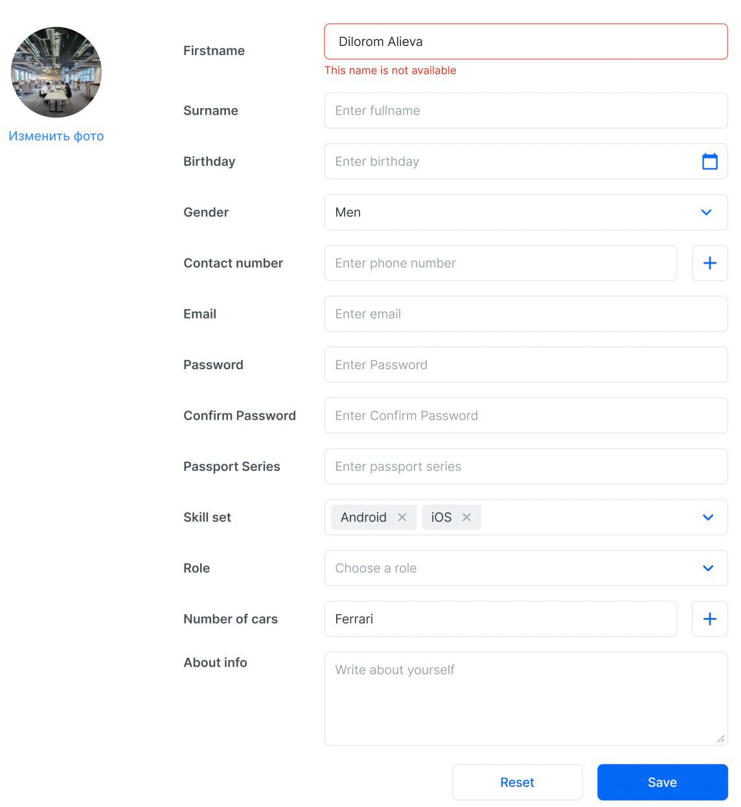

# React roadmap

## Pre-requisites
* Sources
    - [Fundamental roadmap](https://gitlab.udevs.io/Frontend/frontend-roadmap/fundamental-roadmap/-/blob/master/README.md)
## Fundamental Topics
* Sources
    - [Create React App](https://ru.reactjs.org/docs/create-a-new-react-app.html)
    - [JSX](https://www.youtube.com/watch?v=7fPXI_MnBOY)
    - [Components](https://www.youtube.com/watch?v=Y2hgEGPzTZY)
    - [Props vs State](youtube.com/watch?v=qh3dYM6Keuw)
    - [Component Life Cycle](https://ru.reactjs.org/docs/state-and-lifecycle.html)
    - [Lists and Keys](https://ru.reactjs.org/docs/lists-and-keys.html)
    - [Basic Hooks (useState, useEffect)](https://www.youtube.com/watch?v=iEVcCdbF1WQ)
    
## Advanced Topics
* Sources
    - [Hooks](https://www.youtube.com/watch?v=9KJxaFHotqI&t=2084s)
    - [Context](https://ru.reactjs.org/docs/context.html)
    - [Refs](https://ru.reactjs.org/docs/refs-and-the-dom.html)
    - [Render Props](https://ru.reactjs.org/docs/render-props.html)
    - [High Order Components](https://www.youtube.com/watch?v=B6aNv8nkUSw)
    - [Portals](https://www.youtube.com/watch?v=HpHLa-5Wdys)
    - [File structure](https://ru.reactjs.org/docs/faq-structure.html)
## Ecosystem
* Sources
    - [React Routers](https://www.youtube.com/watch?v=0auS9DNTmzE)
    * Api Calls
        - [Fetch](https://www.youtube.com/watch?v=27f3B1qndW8)
        - [Axios](https://www.youtube.com/watch?v=bYFYF2GnMy8)
    * Styling
        - [Material UI](https://mui.com/)
        - [Tailwind CSS](https://tailwindcss.com/docs/installation)
    - [Redux](https://www.youtube.com/watch?v=YdYyYMFPa44)
    * Forms
        - [React Hook Form](https://react-hook-form.com/)
        - [Formik](https://formik.org/)
    * Additions
        - [Next js](https://nextjs.org/)
        - [Gatsby](https://www.gatsbyjs.com/docs/quick-start/)
    * Assignment
        - You have to make playground for form validation using react-hook-form. [Figma is here](https://www.figma.com/file/NNK8PX0MgGVS2KPMFfGy2W/bootcamp?node-id=287%3A19902). After task is done, please deploy it on github.io or other free hosts.
    

# Final assignment instructions 😩
* You will be given blog post [figma here](https://www.figma.com/file/NNK8PX0MgGVS2KPMFfGy2W/bootcamp?node-id=0%3A1) design where you have you implement identical ui. You have to follow several rules given below:
    - Use any editor for implementing given task. ( Atom, VScode...)
    - Don't use any third-party ui lib. ( Bootstrap, Ant design) except Material UI
    - You can use any git cloud service ( Gitlab or github ) and should provide link
    - Yarn should be used during the development.
    - Use firebase for backend API. To learn more [click here](https://www.youtube.com/watch?v=CTLonYohENw).
    

## Books
* Required
    - [The road to React](https://sd.blackball.lv/library/The_Road_to_React_(2020).pdf)
        - You must read the following chapters and complete the exercise given inside the book.
            1. Fundamentals of React 
            2. React's Legacy
            3. Styling in React
        - Homework
            1. Weather App
            - A weather application that provides detailed weather details for a location specified by the user. Built using React and Open Weather API for showing latest weather data. Here we have search options with city and country for which we would like to see weather forecast. We will use the fetch method to fetch the API calls along with the React hooks and conditional rendering.
            2. [Emoji Search](https://ahfarmer.github.io/emoji-search/)
            - We are using several emojis on daily basis while chatting with our friends and colleagues on messaging apps like WhatsApp, Facebook Messenger, Snapchat etc,
A cool searching app where you can type and search any emoji from the given list of emojis.
            3. [Snapshot](https://yog9.github.io/SnapShot/#/SnapScout/mountain)
            - It’s a simple gallery project where we can search the photos by keywords, change the category based on given options as Mountain, Beaches, Birds, Food. Once you hover on the images, you will get the zoom-in images. 

* Additionally
    - [Learning React: Functional Web Development with React and Redux](https://media.graphassets.com/IUzPTEZhTNeVopsd6Xo1?dl=true?dl=true)

## References
- [rebelsky](https://rebelsky.cs.grinnell.edu/Courses/CSC195/2014S/assignments/git.html)
- [rebelsky](https://rebelsky.cs.grinnell.edu/Courses/CSC195/2014S/assignments/git.html)

