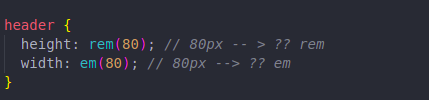

# SCSS roadmap

## Pre-requisites

* Sources
    - [Fundamental roadmap](https://gitlab.udevs.io/Frontend/frontend-roadmap/fundamental-roadmap/-/blob/master/README.md)

## Sass Basics
* Sources
    - [Variables](https://sass-lang.com/documentation/variables)
    - [Nesting](https://www.youtube.com/watch?v=8VAcFxGezjM)
    - [Partials](https://www.youtube.com/watch?v=rB_DbuFCq_w)
    - [Modules](https://sass-lang.com/documentation/at-rules)
    - [Mixins](https://www.youtube.com/watch?v=atd7x0PKV14)
    - [Extend/Inheritance](https://www.youtube.com/watch?v=CWf3kilG9-Y)
    - [Operators](https://sass-lang.com/documentation/operators)
* Assignment
    - Your task is adaptive layout UI using scss. [Figma is here](https://www.figma.com/file/8oy9AQPOMTjZqI1LqDXher/Untitled?node-id=1%3A358). After task is done, please deploy it on github.io or other free hosts.
## Advanced Topics
* Sources
    - [At-rules](https://sass-lang.com/documentation/at-rules)
    - [Values](https://sass-lang.com/documentation/values)
    - [Operators](https://sass-lang.com/documentation/operators)
* Assignment💥
    - Your task is to create functions that convert px to em and rem using scss. Example:
    
