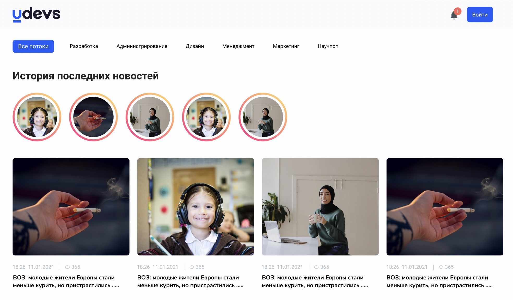

# Vue roadmap 🚀
What is the vuejs ? (https://vuejs.org/)
Vue (pronounced /vjuː/, like view) is a JavaScript framework for building user interfaces. It builds on top of standard HTML, CSS and JavaScript, and provides a declarative and component-based programming model that helps you efficiently develop user interfaces, be it simple or complex.
 ## Disclaimer
* Sources
    - [Fundamental roadmap](https://gitlab.udevs.io/Frontend/frontend-roadmap/fundamental-roadmap/-/blob/master/README.md)
 ## 1.7 Introduction to Essentials of syntax
* Sources
    - [Vue js 2x. in general 1 hour tutorial](https://www.youtube.com/watch?v=nyJSd6V2DRI&list=PL55RiY5tL51p-YU-Uw90qQH419BM4Iz07)
    - [Data binding](https://www.youtube.com/watch?v=xIOwFTCBBDg)
    - [Conditions: v-if, v-else-if, v-else, v-show ](https://v2.vuejs.org/v2/guide/conditional.html)
    - [Looping and listing v-for... ](https://v2.vuejs.org/v2/guide/list.html)
    - [Directives ](https://v2.vuejs.org/v2/api/?redirect=true#Vue-directive)
    - [Vuejs modifiers ](https://v2.vuejs.org/v2/guide/syntax.html?redirect=true#Modifiers)
    - [Event Handling ](https://v2.vuejs.org/v2/guide/events.html?redirect=true#Method-Event-Handlers)
    - [Lifecycle Hooks ](https://v2.vuejs.org/v2/api/?redirect=true#Options-Lifecycle-Hooks)
    - [Reactivity ](https://www.youtube.com/watch?v=sAj6tdVS2cA)
* Additions
    - [Vue 3x.](https://www.youtube.com/watch?v=A5cVyjrKx_Q)
    - [Composition API.](https://www.youtube.com/watch?v=bwItFdPt-6M)
    - [Template structure](https://www.youtube.com/watch?v=8vp5OXcbM34)
    - [Async components](https://www.youtube.com/watch?v=UAhBc0Rse9Q)
    - [Custom plugins](https://www.youtube.com/watch?v=ar1fJECxbyU)
    - [Transitions](https://www.youtube.com/watch?v=NzFRZKho23k)
    - [Performance](https://www.youtube.com/watch?v=nwQN55oPAfc)
    - Lifecycle Hooks 
## 1.8 Introduction to Styling
* Sources
    - [Single file components](https://v2.vuejs.org/v2/guide/single-file-components.html?redirect=true)
    - Component libraries
        - [Ant design](https://antdv.com/)
        - [Material ui](https://www.youtube.com/watch?v=1j8xTOmR8pw)
        - [Vuesax - get started !](https://www.youtube.com/watch?v=RA7sO_9V3vw)
        - [Vuetify](https://www.youtube.com/playlist?list=PL4cUxeGkcC9g0MQZfHwKcuB0Yswgb3gA5)
* Additions
    - [Introduction of preprocessor Stylus](https://www.youtube.com/playlist?list=PLLnpHn493BHFWQGA1PcyQZWAfR96a4CkH)
    - [Introduction of preprocessor SASS](https://www.youtube.com/watch?v=_a5j7KoflTs)
    - [Introduction of preprocessor LESS](https://www.youtube.com/playlist?list=PLLAZ4kZ9dFpNmzIb3XQi5QSFiEpK-UxUg)
 ## 1.9 Code styling
 * Sources
    - [Eslint](https://www.youtube.com/playlist?list=PL_euSNU_eLbeVd_eDmWzUpEmXizWQRmEm)
    - [Prettier](https://www.youtube.com/watch?v=h3PJjP0nE98)
    - [Setup eslint and prettier in vue project ](https://www.youtube.com/watch?v=7qfMmCN4Uwk)
 ## 2.0 State management
 * Sources
    - [Vuex](https://www.youtube.com/watch?v=c2SK1IlmYL8)
 ## 2.1 Routing
 * Source
    - [Vue router](https://www.youtube.com/watch?v=rqB7jRunukw)
    - [keep-alive](https://vuejs.org/guide/built-ins/keep-alive.html#keepalive)
 ## 2.2 Working with APIs
 * Sources
    - [Introduction to REST API](https://www.youtube.com/watch?v=qbLc5a9jdXo)
    - [Introdcution to Graphql in vue - get started !](https://www.youtube.com/watch?v=W_xft6HZecQ)
    - [Working with JSON data](https://www.youtube.com/watch?v=uxf0--uiX0I)
 ## 2.3 Testing
 * Sources
    - [Introduction to Unit testing, JEST](https://www.youtube.com/watch?v=FgnxcUQ5vho)
* Additions
    - [JavaScript Testing Introduction Tutorial - Unit Tests, Integration Tests & e2e Tests](https://www.youtube.com/watch?v=r9HdJ8P6GQI)
 ## 2.4 Internationalization
 * Sources
    - [Introduction to vue-i18n](https://www.youtube.com/watch?v=UF2p1vTS2ZM)
* Additions
    - [Building in JavaScript with Internationalization (I18N) in Mind](https://medium.com/adobetech/building-in-javascript-with-internationalization-i18n-in-mind-815b6bf2c25e#:~:text=Internationalization%20(I18N)%20is%20the%20process,and%20access%20a%20wider%20audience.)
 ## 2.5 Utility libraries
 * Sources
    - [Date -fns](https://www.youtube.com/watch?v=9YZIQAmgD0o)
* Additions
    - [RXjs](https://www.youtube.com/watch?v=gCwSVQO_PtY)
    - [Google map in vue](https://www.youtube.com/watch?v=KARBEHUyooM)
    - [Yandex map in vue - Docs](https://vue-yandex-maps.github.io/guide/)
    - [Vue validate ](https://vee-validate.logaretm.com/v4/)
* Assignment
    - You have to make playground for form validation using Vue - validate . [Figma is here](https://www.figma.com/file/NNK8PX0MgGVS2KPMFfGy2W/bootcamp?node-id=287%3A19902). After task is done, please deploy it on github.io or other free hosts.
    

 ## 2.6 SSR in Vue
 * Sources
    - [Introduction to SSR in 6 minutes](https://www.youtube.com/watch?v=GQzn7XRdzxY)
    - [Nuxt js with Max 🥳](https://www.youtube.com/watch?v=PVMOQrdEjB0)

# Final assignment instructions 😩
* You will be given blog post [figma here](https://www.figma.com/file/NNK8PX0MgGVS2KPMFfGy2W/bootcamp?node-id=0%3A1) design where you have you implement identical ui. You have to follow several rules given below:
    - Use any editor for implementing given task. ( Atom, VScode...)
    - Use Vue 2 or Vue 3 version
    - Don't use any third-party ui lib. ( Bootstrap, tailwind) except Vuetify and Ant design
    - You can use any git cloud service ( Gitlab or github ) and should provide link
    - Yarn should be used during the development.
    - Use firebase for backend API. To learn more [click here](https://www.youtube.com/watch?v=CTLonYohENw).
    

## References
- [rebelsky](https://rebelsky.cs.grinnell.edu/Courses/CSC195/2014S/assignments/git.html)
- [rebelsky](https://rebelsky.cs.grinnell.edu/Courses/CSC195/2014S/assignments/git.html)
