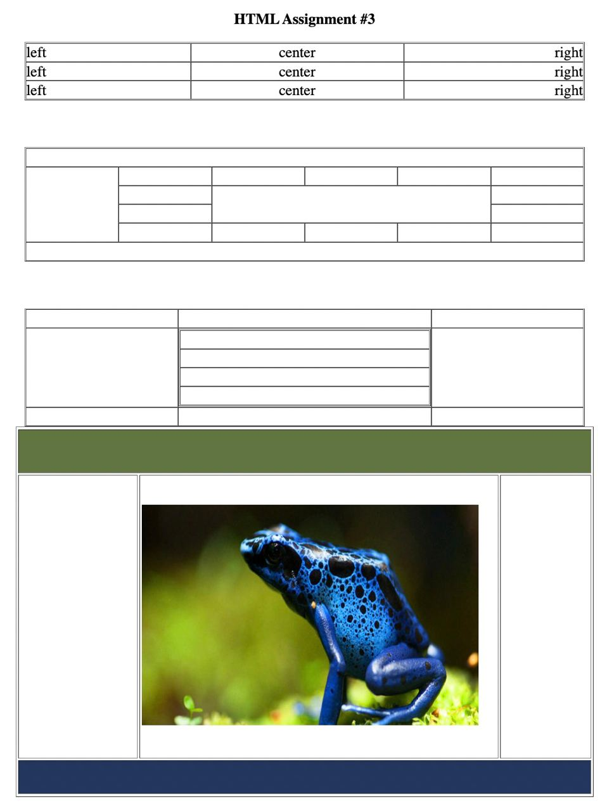
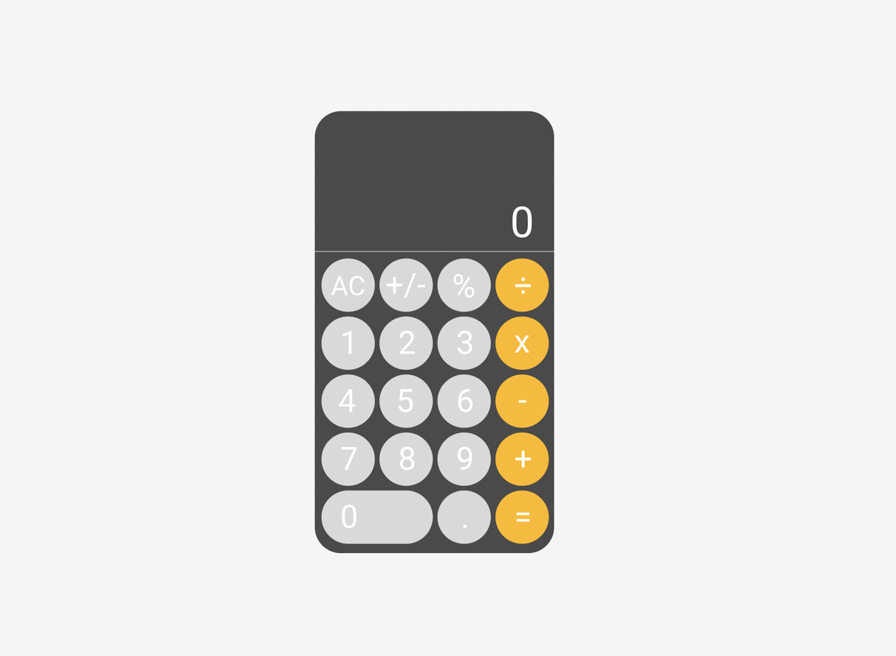
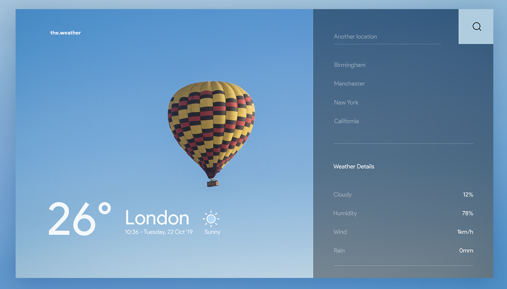

# JavaScript roadmap
  JavaScript (JS) is a lightweight, interpreted, or just-in-time compiled programming language with first-class functions. While it is most well-known as the scripting language for Web pages, many non-browser environments also use it, such as Node.js, Apache CouchDB and Adobe Acrobat. JavaScript is a prototype-based, multi-paradigm, single-threaded, dynamic language, supporting object-oriented, imperative, and declarative (e.g. functional programming) styles

## Disclaimer
> This roadmap can be forked, shared and edited. If you like this roadmap just, give some stars 🙂

## 1.1 Select IDE's

* Sources
	- [Visual studio Code](https://www.youtube.com/watch?v=VqCgcpAypFQ)
	
	- [ATOM](https://www.youtube.com/watch?v=aiXNKHKWlmY)
	
	- [Sublime text editor](https://www.youtube.com/playlist?list=PLpcSpRrAaOaqQMDlCzE_Y6IUUzaSfYocK)
	
	- [Brackets](https://www.youtube.com/watch?v=GN0txxeT46A)
	
	- [Intellij Webstorm](https://www.youtube.com/watch?v=WlBrhM1_t5k)


* Assignment
    * Download and install VS Code.
	* Create a new file.
	* See an overview of the user interface.
	* Install support for your favorite programming language.
	* Change your keyboard shortcuts and easily migrate from other editors using keymap extensions.

	* Customize your editor with themes.

	* Explore VS Code features in the [Interactive Editor Playground](https://code.visualstudio.com/docs/introvideos/basics).

## 1.2 Introduction to HTML

* Sources

	- [Basic of HTML](https://www.youtube.com/watch?v=qz0aGYrrlhU)

	- [Semantic HTML](https://www.youtube.com/watch?v=kGW8Al_cga4)

	- [HTML forms](https://www.youtube.com/watch?v=fNcJuPIZ2WE)

	- [HTML graphics](https://www.youtube.com/watch?v=3GqUM4mEYKA)

	- [HTML multimedia and video players](https://www.youtube.com/watch?v=OOy764mDtiA)

* Assignment

	- Create this table structure using HTML table tags and attributes. You can deploy your assignment using github pages ( [tutorial here](https://www.youtube.com/watch?v=QyFcl_Fba-k) )



## 1.3 Introduction to CSS

* Sources

	- [Learn basics of CSS](https://www.youtube.com/watch?v=1PnVor36_40)

	- [Intro to Grids](https://www.youtube.com/watch?v=jV8B24rSN5o)

	- [Flexbox](https://www.youtube.com/watch?v=JJSoEo8JSnc)

	- [Media queries in 7 minutes](https://www.youtube.com/watch?v=yU7jJ3NbPdA)

	- [Typography in css](https://www.youtube.com/watch?v=1bfV3z4HKlw)

	- [Introduction to preprocessors](https://www.youtube.com/watch?v=PJkWbezpHpE)

* Assignment

	- Your task is to implement this given UI. No need any functionality here. You will modify it later in JS module.
		- [Figma link](https://www.figma.com/file/kdEk2uNk9Rgh2xqxHSFBrt/%D0%9A%D0%B0%D0%BB%D1%8C%D0%BA%D1%83%D0%BB%D1%8F%D1%82%D0%BE%D1%80-%7C-Calculator-(Community)?node-id=0%3A1)




## 1.4 Version Controls

* Sources

	- [Learn basics of git](https://www.youtube.com/watch?v=RGOj5yH7evk)

	- [Gitlab introductions](https://www.youtube.com/watch?v=gbJUasioKiI)

	- [Github introductions](https://www.youtube.com/watch?v=w3jLJU7DT5E)

* Assignment

	- This assignment gives you a chance to explore basic use of Git and GitHub.
```git
git clone <REPO_URL>

Make a copy of a repository. A typical repository address is https://github.com/Grinnell-CSC195/hw1

git add FILE

This can do one of two things. If FILE is not in the repository, it adds it to the repository. If FILE is already in the repository, it marks it as being part of the current set of files to be committed. (Often, you only want to commit only a subset of the files you've modified, so you use git add on each of those.)

git status

Get the status of your repository. What files have been modified? Which are staged for commit? Which are just new?

git commit

Commits all of the files you're added. Typically, pops up an editor. If vi pops up, use i to switch to insert mode, type the text for the commit, and then type the escape key to get out of insert mode. Then, type :wq to write the file and quit vi.

git commit -m "MESSAGE"

Commits the files you've added, using the given message. (A nice way to avoid the editor.)

git log | less  

Shows a log of the changes that have been made. (less lets you page through those changes.)

git push

Send your commits to the primary repository.

git pull

Grab other people's commits from the primary repository.
```

## 2.1 Basics of JS
### Variables and data types
* Sources
	- Variables
		
		- [W3School - # JavaScript  Variables](https://www.w3schools.com/js/js_variables.asp)
		
		- [javascript.info - # Variables](https://javascript.info/variables)
		
		- [youtube - # Differences Between Var, Let, and Const](https://www.youtube.com/watch?v=9WIJQDvt4Us)
	
	- Data types
		
		- [W3School - # JavaScript  Data Types](https://www.w3schools.com/js/js_datatypes.asp)
		
		- [javascript.info - # Data types](https://javascript.info/types)
		
		- [youtube - # Data Types](https://www.youtube.com/watch?v=808eYu9B9Yw)

### Basic arithmetic operators
* Sources
		
	- [W3School - # JavaScript  Arithmetic](w3schools.com/js/js_arithmetic.asp)
	
	- [javascript.info - # Basic operators, maths](https://javascript.info/operators)
		
	- [youtube - # Math operators](https://www.youtube.com/watch?v=SpUJIE0hcJg)

### Conditional operators
* Sources
	- If, else
		
		- [W3School - # JavaScript if, else, and else if](https://www.w3schools.com/js/js_if_else.asp)
		
		- [javascript.info - # Conditional branching: if, '?'](https://javascript.info/ifelse)
		
		- [youtube - # JavaScript if else (tutorial)](https://www.youtube.com/watch?v=IsG4Xd6LlsM)

	- Switch, case
		
		- [W3School - # JavaScript  Switch  Statement](https://www.w3schools.com/js/js_switch.asp)
		
		- [javascript.info - # The "switch" statement](https://javascript.info/switch)
		
		- [youtube - # Switch Statements](https://www.youtube.com/watch?v=fM5qnyasUYI)

### Loops
* Sources
	- [W3School - # JavaScript  For Loop](https://www.w3schools.com/js/js_loop_for.asp)

	- [W3School - # JavaScript  While Loop](https://www.w3schools.com/js/js_loop_while.asp)
	
	- [javascript.info - # Loops: while and for](https://javascript.info/while-for)
	
	- [youtube - # JavaScript For Loops](https://www.youtube.com/watch?v=s9wW2PpJsmQ)

	- [youtube - # While / Do Whiles](https://www.youtube.com/watch?v=v9zgD8wjtbw)

### Arrays
* Sources
	- [W3School - # JavaScript  Arrays](https://www.w3schools.com/js/js_arrays.asp)
	
	- [javascript.info - # Arrays](https://javascript.info/array)

	- [youtube - # Javascript Arrays - Creating, Accessing and Looping Through Arrays in Javascript](https://www.youtube.com/watch?v=Lf9rG5DsQYg)

### Objects
* Sources
	- [W3School - # JavaScript  Objects](https://www.w3schools.com/js/js_objects.asp)
	
	- [javascript.info - # Objects](https://javascript.info/object)

	- [youtube - # What Are Objects in JavaScript](https://www.youtube.com/watch?v=4uVwGw317QM)

### Functions
* Sources
	- [W3School - # JavaScript  Functions](https://www.w3schools.com/js/js_functions.asp)
	
	- [javascript.info - # Functions](https://javascript.info/function-basics)

	- [youtube - # Modern JavaScript Tutorial - Functions](https://www.youtube.com/watch?v=xUI5Tsl2JpY)


### Assignment

	- Given a number  `x`, return  `true`  if  `x`  is palindrome number.

		An integer is a  **palindrome**  when it reads the same backward as forward.

		 For example,  `121`  is a palindrome while  `123`  is not..

			Example 1:

			Input: x = 121
			Output: true
			Explanation: 121 reads as 121 from left to right and from right to left.

			Example 2:

			Input: x = -121
			Output: false
			Explanation: From left to right, it reads -121. From right to left, it becomes 121-. Therefore it is not a palindrome.

			Example 3:

			Input: x = 10
			Output: false
			Explanation: Reads 01 from right to left. Therefore it is not a palindrome.


	-	Given an array `arr`, remove the duplicates such that each unique element appears only **once**. 
			
			Example 1:

			Input: arr = [1, 1, 2, 2, 2, 3, 3, 3, 4]
			Output: [1, 2, 3, 4]

			Example 2:

			Input: x = ['a', 'b', 'a', 'b', 'c', 'c', 'd']
			Output: ['a', 'b', 'c', 'd']

	- Given a sorted array of distinct numbers and a target value, return the index if the target is found. If not, return the index where it would be if it were inserted in order
			Example 1:

			Input: nums = [1,3,5,6], target = 5
			Output: 2

			Example 2:

			Input: nums = [1,3,5,6], target = 2
			Output: 1

			Example 3:

			Input: nums = [1,3,5,6], target = 7
			Output: 4


## 2.2 DOM

### DOM manipulations
* Sources
	- [W3School - # JavaScript  HTML DOM Elements](https://www.w3schools.com/js/js_htmldom_elements.asp)
	
	- [W3School - # Changing HTML](https://www.w3schools.com/js/js_htmldom_html.asp)

	- [W3School - # Changing HTML](https://www.w3schools.com/js/js_htmldom_html.asp)

	- [javascript.info - # Modifying the document](https://javascript.info/modifying-document)

	- [youtube - # Learn DOM Manipulation](https://www.youtube.com/watch?v=y17RuWkWdn8)

### DOM manipulations
* Sources
	- [W3School - # JavaScript  HTML DOM Elements](https://www.w3schools.com/js/js_htmldom_elements.asp)
	
	- [W3School - # Changing HTML](https://www.w3schools.com/js/js_htmldom_html.asp)

	- [W3School - # Changing HTML](https://www.w3schools.com/js/js_htmldom_html.asp)

	- [javascript.info - # Modifying the document](https://javascript.info/modifying-document)

	- [youtube - # Learn DOM Manipulation](https://www.youtube.com/watch?v=y17RuWkWdn8)
	
### DOM events
* Sources
	- [W3School - # JavaScript  HTML DOM Events](https://www.w3schools.com/js/js_htmldom_events.asp)
	
	- [W3School - # JavaScript  HTML DOM EventListener](https://www.w3schools.com/js/js_htmldom_eventlistener.asp)

	- [javascript.info - # Introduction to browser events](https://javascript.info/introduction-browser-events)

	- [youtube - # JavaScript mouse events](https://www.youtube.com/watch?v=pAnh6GaaAv4)

	- [youtube - # Keyboard Events with Javascript](https://www.youtube.com/watch?v=YUdc2szWz8Q)


### Assignment
* Make the functionality for the calculator that you made in the CSS module. Make the input both through the buttons and through the keyboard
	

## 2.3 Promises

### Promise basics
* Sources
	- [W3School - # JavaScript Promises](https://www.w3schools.com/js/js_promise.asp)

	- [javascript.info - # Promise](https://javascript.info/promise-basics)

	- [youtube - # JavaScript Promises](https://www.youtube.com/watch?v=DHvZLI7Db8E)

### Async, await
* Sources
	- [W3School - # JavaScript Async](https://www.w3schools.com/js/js_async.asp)

	- [javascript.info - # Async/await](https://javascript.info/async-await)

	- [youtube - # JavaScript Async Await](https://www.youtube.com/watch?v=V_Kr9OSfDeU)

### Promise all
* Sources
	- [MDN web docs - # Promise.all()](https://developer.mozilla.org/en-US/docs/Web/JavaScript/Reference/Global_Objects/Promise/all)

	- [javascript.info - # Promise API - Promise.all](https://javascript.info/promise-api)

	- [youtube - # Promise.all() function in Javascript](https://www.youtube.com/watch?v=SyL1thdXmlE)

### Try catch
* Sources
	- [MDN web docs - # try...catch](https://developer.mozilla.org/ru/docs/Web/JavaScript/Reference/Statements/try...catch)

	- [javascript.info - # Error handling, "try...catch"](https://javascript.info/try-catch)

	- [youtube - # error handling in JavaScript](https://www.youtube.com/watch?v=cFTFtuEQ-10)

### Assignment
* Create a weather web application
	- Use 3 party API in order to get Weather info
	- Create identical UI
	- Make a list of regions of Uzbekistan in right side of panel
	- Auto change wallpaper according to weather state (e.g., if it is sunny, show lighter images else, show darker images)
	- Do responsible design (Mobile app)
	- Add searching functionality for countries or regions
	- [Resource](https://dribbble.com/shots/7767460-Weather-App-Website/attachments/448095?mode=media)
	- [Weather API](https://openweathermap.org/api)

		
	
## 2.4 AJAX

* Sources
	- [W3School - # XMLHttpRequest](https://www.w3schools.com/js/js_ajax_http_send.asp)

	- [javascript.info - # Fetch](https://javascript.info/fetch)

	- [youtube - # XMLHttpRequest](https://www.youtube.com/watch?v=ZgH68Wg8M68)

	- [youtube - # Learn Fetch API](https://www.youtube.com/watch?v=cuEtnrL9-H0)

### Assignment
* Create a todo web application
	- Use jsonplaceholder API
	- Use all CRUD operations (GET, POST, PUT, DELETE)
	- Do responsible design (Mobile app)

	- [JSONplaceholder API](https://jsonplaceholder.typicode.com/)

		


## 2.5 EcmaScript 6

* Sources
	- [W3School - # Javascript ES6](https://www.w3schools.com/js/js_es6.asp)

	- [javascripttutorial.net - # Fetch](https://www.javascripttutorial.net/es6/)

	- [youtube - # JavaScript ES6, ES7, ES8](https://www.youtube.com/watch?v=nZ1DMMsyVyI)

## Bonus (Useful methods)

* Sources
	- [String methods](https://javascript.info/string)

	- [Number methods](https://medium.com/swlh/12-most-common-javascript-number-methods-4dfeedb7f2af)

	- [Array methods](https://javascript.info/array-methods)
	
	- [Math methods](https://www.w3schools.com/js/js_math.asp)

